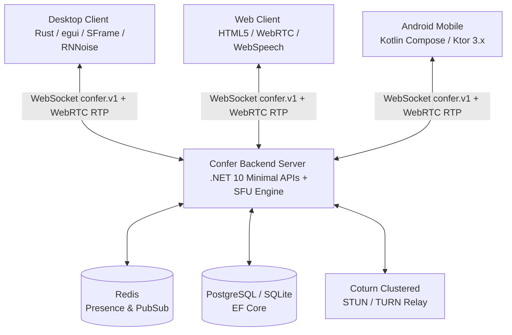

# 🏛️ Confer Technical Architecture Deep-Dive

This document details the engineering principles, design patterns, media transport structures, and security mechanisms powering the **Confer** ecosystem.

---

## 1. Architectural Philosophy

Confer is designed from the ground up to achieve **sub-50ms glass-to-glass latency**, **zero Electron/Chromium desktop overhead**, and **infinite horizontal cloud scaling**.



---

## 2. Backend Architecture (.NET 10 Clean Architecture + DDD + CQRS)

The backend follows strict Domain-Driven Design (DDD) and Clean Architecture layer boundaries:

```
src/
├── domain/                  # 1. Pure Domain Layer (zero dependencies)
│   ├── Meetings/            # Aggregate Roots (Meeting), Entities (Poll, BreakoutRoom, Summary)
│   ├── Sessions/            # Session, Participation, ChatMessage
│   ├── Identity/            # User Entity, Value Objects
│   ├── Auth/                # IdentityProviderType, SSO metadata
│   └── Webhooks/            # WebhookSubscription Entity
│
├── application/             # 2. Application Layer (CQRS Slices & Use Cases)
│   ├── Meetings/            # Create, Join, Lock, Polls, Breakouts, Governance, Summary, Telephony
│   ├── Auth/                # DevLogin, Sso (Authorize, Callback)
│   ├── Webhooks/            # Create, List, Delete, Dispatch
│   └── Common/              # ICqrsDispatcher, FluentValidation Behaviors, DTOs
│
├── infrastructure/          # 3. Infrastructure Layer (I/O & Concrete Engines)
│   ├── Media/               # SfuRoomManager, RoomMediaSession, Simulcast Layer Selector
│   ├── Signal/              # WebSocketSignalingHandler (confer.v1 protocol)
│   ├── AI/                  # ConferAiCompanionService (@confer-ai), SmartAiSummaryService
│   ├── Telephony/           # TwilioSipTelephonyBridge (PSTN / SIP Inbound)
│   ├── Auth/Sso/            # SsoAuthenticationService (Google, Microsoft, Okta, SAML)
│   ├── Persistence/         # EF Core ConferDbContext, LocalDiskRecordingStorage
│   └── Observability/       # ConferMetrics (Prometheus & OpenTelemetry Meters)
│
├── api/                     # 4. Presentation / API Layer
│   ├── Endpoints/           # Minimal API Endpoint Modules (Meetings, Auth, Webhooks, Telephony)
│   └── wwwroot/             # Embedded Zero-Install Web Client (HTML5 / ES6)
│
└── shared/                  # 5. Shared Kernel
    ├── Results/             # Functional Result<T>, Error Catalog
    └── Application/         # ICqrsDispatcher, ICommand, IQuery, ICommandHandler, IQueryHandler
```

---

## 3. Real-Time Wire Protocol (`confer.v1`)

Signaling is conducted over persistent WebSockets with subprotocol `confer.v1`.

### Client Message Types
| Type | Payload Schema | Description |
| :--- | :--- | :--- |
| `join` | `{ room_token, display_name, client_info }` | Authenticate and join conference session |
| `ping` | `{ seq }` | Heartbeat keep-alive & RTT measurement |
| `mute_audio` | `{ is_muted }` | Mute or unmute microphone |
| `mute_video` | `{ is_muted }` | Turn camera video on/off |
| `screen_share` | `{ is_sharing }` | Start or stop screen sharing stream |
| `chat_message` | `{ message, target_participant_id? }` | Broadcast public or direct chat message |
| `reaction` | `{ emoji }` | Broadcast emoji reaction particle |
| `hand_raise` | `{ is_raised }` | Raise or lower participant hand |
| `create_poll` | `{ poll_id, question, options, multi_choice, is_anonymous }` | Launch live poll |
| `vote_poll` | `{ poll_id, selected_options }` | Cast vote on active poll |
| `whiteboard_stroke` | `{ stroke: { tool, color, stroke_width, points } }` | Synchronize whiteboard vector stroke |
| `whiteboard_clear` | `{}` | Clear collaborative whiteboard canvas |
| `caption_chunk` | `{ text, is_final, language, timestamp_ms }` | Stream live speech-to-text transcript |
| `admit_participant`| `{ participant_id }` | Host: Admit waiting room participant |
| `admit_all` | `{}` | Host: Admit all waiting room participants |
| `reject_participant`| `{ participant_id }` | Host: Reject waiting room participant |
| `update_policy` | `{ policy: { allow_screen_share, allow_chat, ... } }` | Host: Update room security policies |

---

## 4. Zero-Knowledge Media Encryption (IETF SFrame RFC)

Confer implements the **IETF SFrame** (Secure Frame) standard for authenticated end-to-end payload encryption over RTP:

```
+-------------------+--------------------+------------------------+
| SFrame Header     | Encrypted Payload  | Authentication Tag     |
| (KID + Counter)   | (Opus Audio / VP8) | (AES-128 / 256 GCM)    |
+-------------------+--------------------+------------------------+
```

1. **Short/Extended Key ID (`KID`)**: Compact 4-bit `KID` (0..15) for minimum header overhead.
2. **Deterministic Nonce Computation**: `Nonce = BaseIV XOR Counter`.
3. **Authenticated Header (AAD)**: The SFrame header is passed as Additional Authenticated Data (`AAD`) preventing header tampering.
4. **RFC 6479 Replay Window**: 128-bit sliding-window bitmap filtering out duplicate and replayed packets.
5. **HKDF-SHA256 Forward Secrecy**: Dynamic key ratcheting and epoch rotation.

---

## 5. Native Rust Desktop Client (< 40 MB RAM)

Built with immediate-mode GUI **`egui` / `eframe`**:
- **Zero Electron / Chromium**: Runs directly on the system GPU via hardware-accelerated OpenGL/Vulkan.
- **Audio Subsystem**: Low-latency PCM capture via **`cpal`** (PulseAudio / PipeWire / ALSA) with real-time **RNNoise 48 kHz** neural suppression.
- **Video Capture**: Direct V4L2 / Video4Linux frame grabbing and VP8 payload assembly.
